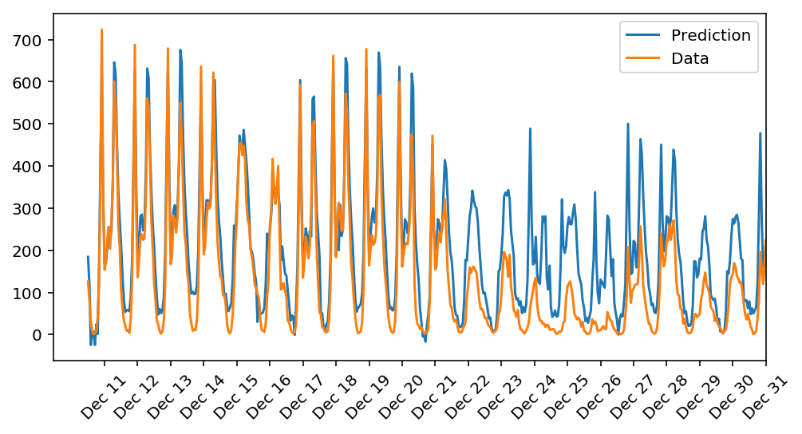

# udacity-deep-learning-project-1-bike-sharing-pattern
In this project, I will build a neural network from scratch to carry out a prediction problem on a real dataset! By building a neural network from the ground up, I will have a much better understanding of gradient descent, backpropagation, and other concepts that are important to know before we move to higher-level tools such as PyTorch. I will also get to see how to apply these networks to solve real prediction problems!

  

The data comes from the [UCI Machine Learning Database](https://archive.ics.uci.edu/ml/datasets/Bike+Sharing+Dataset).

## Prerequisites
- Python 3.x
- Numpy v1.19
